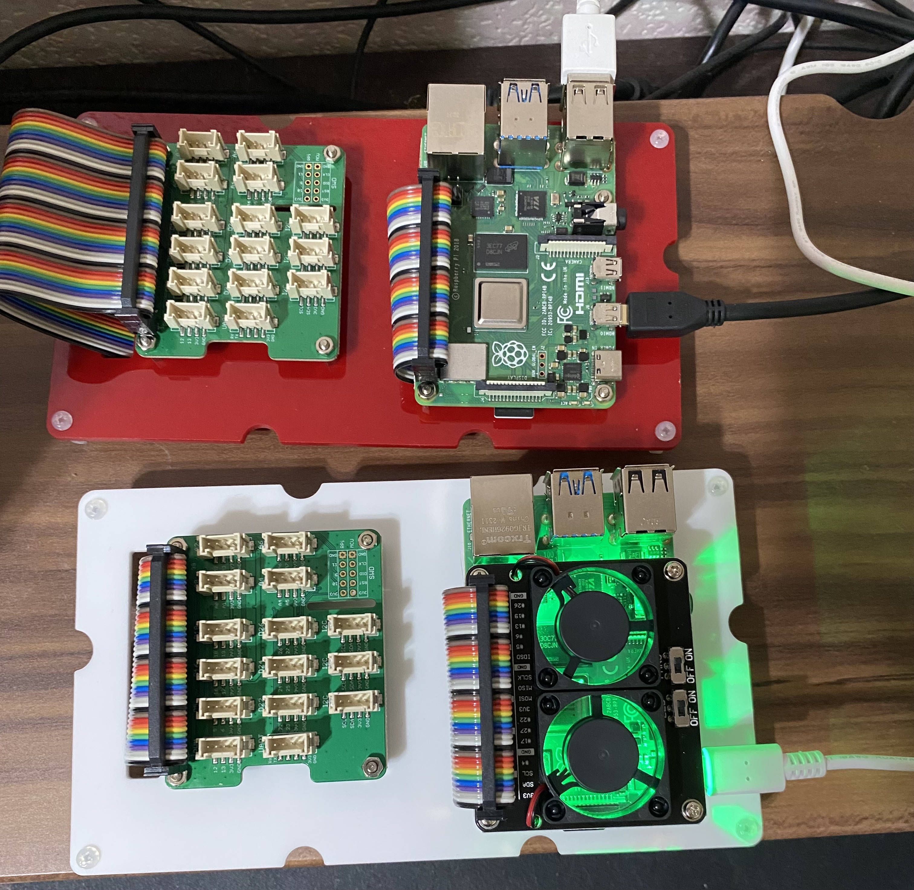
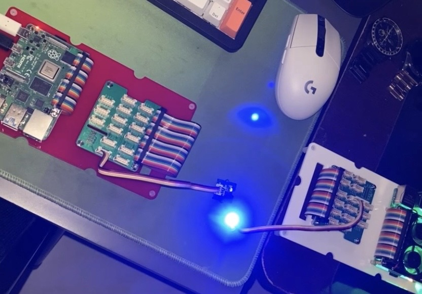

# Wireless Sensing Beacon Communication System
## Introduction

This project implement the wireless communication of two Raspberry PI. I will call the receiver as machine A and sender as machine B below.  
Machine A will broadcast the Eddystone UID or URL by bluetooth to another machine B.

Then after machine B receive the Eddystone UID or URL, it will encode it and transmitt the signal through LED light. The groove sensor on machine A will recieve the light signal and decode it. If the decoded message is the same as the broadcasted message, it makes a handshake.
  
- Demo Video Link: https://youtu.be/VEFHrQNWKng
- Report: Please refer to "Wireless Sensing Report.pdf" for detail description.

## Replicate Guide
1. Install HCI tools
2. Setup the groove sensor on the receiver Raspberry PI.
3. Place the receiver code on the receiver machine.
4. Setup the LED on the sender Raspberry PI.
5. Place the sender code on the sender machine.